<div align="center">


# FastAccountingSoftware

**Smart Accounting. Faster Business.**

A modern, full-featured desktop accounting system built with WPF (.NET 8) for Nigerian small-to-medium businesses. Manage your finances, staff, customers, inventory, invoices, and payroll — all from one beautiful interface.

[](LICENSE)
[](https://github.com/segunmicheal27/FastAccountingSoftware)
[](https://dotnet.microsoft.com/)
[](https://github.com/segunmicheal27/FastAccountingSoftware/releases/latest)

</div>

---

## ⬇️ Download & Install

> **[👉 Click here to download the latest release (.exe)](https://github.com/segunmicheal27/FastAccountingSoftware/releases/latest)**

1. Download **`FastAccountingSoftware-v1.0.0-Setup.exe`** from the Releases page
2. Double-click the file to launch — **no installation wizard needed**
3. The app opens immediately and runs fully portable from any folder

> ⚠️ **Windows SmartScreen may appear** — click **"More info"** then **"Run anyway"**. The app is safe.

> ⚠️ **Requirement:** [.NET 8.0 Desktop Runtime](https://dotnet.microsoft.com/en-us/download/dotnet/8.0) must be installed on the target PC. Download **".NET Desktop Runtime 8"** (not SDK).

---

## 🚀 First-Time Setup (Getting Started)

Follow these steps when you open the app for the very first time:

### Step 1 — Log in as Admin
The app comes with one built-in admin account ready to use:

| Field | Value |
|-------|-------|
| **Role** | Admin |
| **Username** | `admin` |
| **Password** | `password` |

> On the login screen, make sure **"Admin"** tab is selected (not Staff), then enter the credentials above and click **Sign In** or press **Enter**.

> ℹ️ **Staff accounts do not exist yet** at this point. Staff logins are only available after you load demo data (Step 2) or after the admin manually creates staff members from the **Staff** page.

---

### Step 2 — Load Demo Data
The app starts with an empty database. To populate it with realistic sample data (customers, transactions, staff, invoices, inventory):

1. After logging in, click **⚙ Settings** at the bottom of the left sidebar
2. Scroll to the **"Data Management"** section
3. Click the **"Load Demo Data"** button
4. Wait a few seconds — the system will seed ~1,500+ records including:
   - 50+ customers with Nigerian business names
   - Income & expense transactions across 6 months
   - Staff members with payroll history
   - Inventory products with stock levels
   - Invoices in various statuses (Paid, Unpaid, Overdue)

> ✅ Once loaded, navigate to **Dashboard** to see your financial overview, charts, and AI insights.

---

### Step 3 — Set Up Your Company Profile
1. Click **⚙ Settings** → scroll to **"Company Profile"**
2. Enter your **Company Name**, **Business Email**, and **Physical Address**
3. Under **"Financial Preferences"**, set your:
   - **Currency Symbol** (default: ₦ Nigerian Naira)
   - **Corporate Income Tax Rate** (default: 30%)
   - **Fiscal Year Start Month** (default: January)
4. Click **"Save Financial Settings"**

---

### Step 4 — Change the Default Password
1. In **Settings**, find the **"Administrator Account"** section
2. Enter a new secure password
3. Click **"Update Credentials"**

> 🔐 Do this before adding real business data — the default password `password` is for demo use only.

---

## 🔑 Login Credentials

### Built-in Admin Account (always available)
| Role | Username | Password | Notes |
|------|----------|----------|-------|
| **Admin** | `admin` | `password` | Full access — available immediately on first launch |

### Demo Staff Accounts (only available after loading demo data)
> ⚠️ **Staff accounts do not exist by default.** They are only created when:
> - The admin clicks **"Load Demo Data"** in Settings (loads sample staff), OR
> - The admin manually adds a staff member from the **Staff** page

After loading demo data, these sample staff logins will be available:

| Role | Username | Password | Notes |
|------|----------|----------|-------|
| **Staff** | `zainabhauwa` | `password` | Restricted access (no staff tab, no company edit, customer data hidden) |
| **Staff (by ID)** | `sf-XXXX` | `password` | Find each staff member's exact ID on the Staff page (Admin only) |

> 💡 When the admin creates a new staff member, the system auto-generates a unique Staff ID (e.g. `sf-4821`) and a username. The admin can then send or copy the credentials from the staff detail popup.

---

## 📸 Screenshots

<div align="center">

### Splash Screen
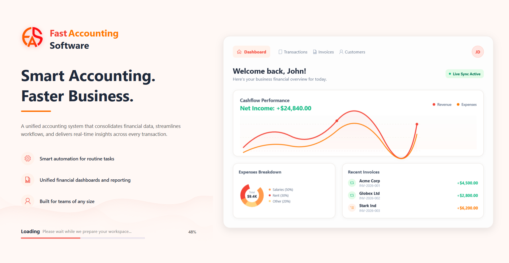
*Interactive custom loading screen with database checks.*

### Login Page (Dual-Role)
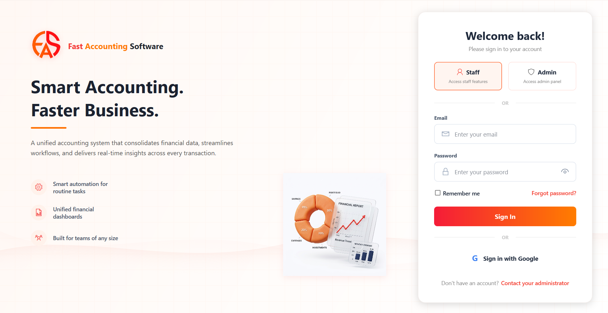
*Admin & Staff login toggle. Log in securely with admin credentials.*

### Dashboard Page
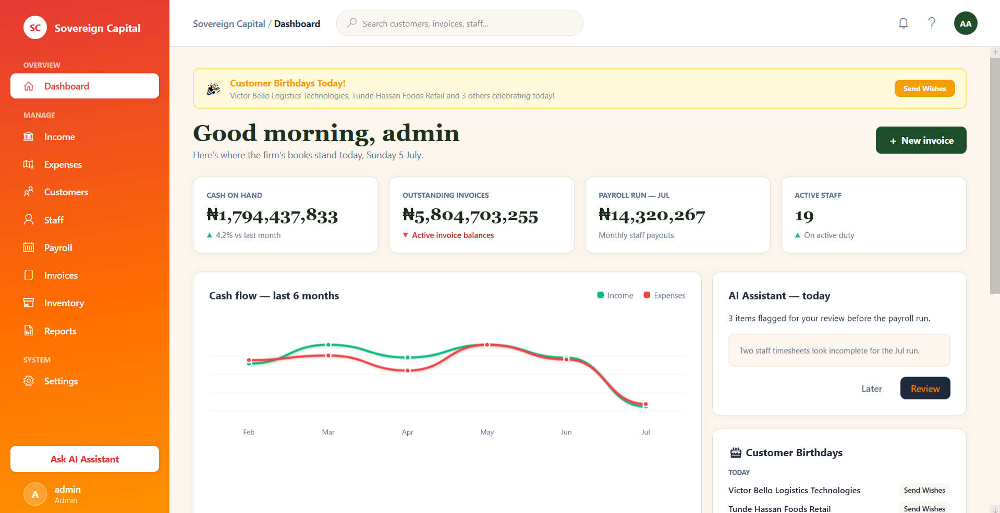
*Real-time metrics, cash-flow summary, AI assistant, and customer birthday reminders.*

### Customer Management
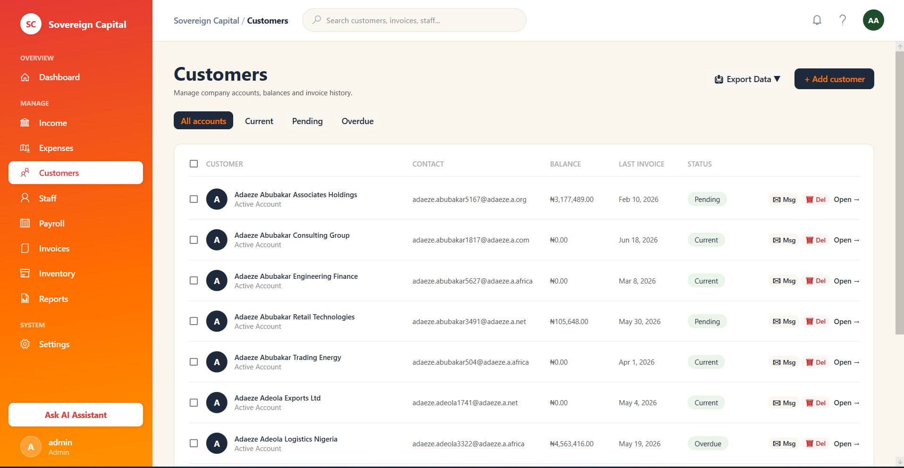
*Manage customer profiles, view balances, send direct wishes, and paginate through records.*

### Inventory Catalogue
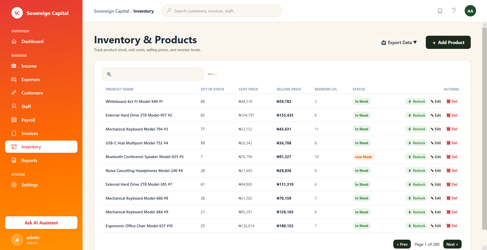
*Track stock levels, cost/selling prices, markups, and reorder levels with auto-expense on restocking.*

### Staff Page
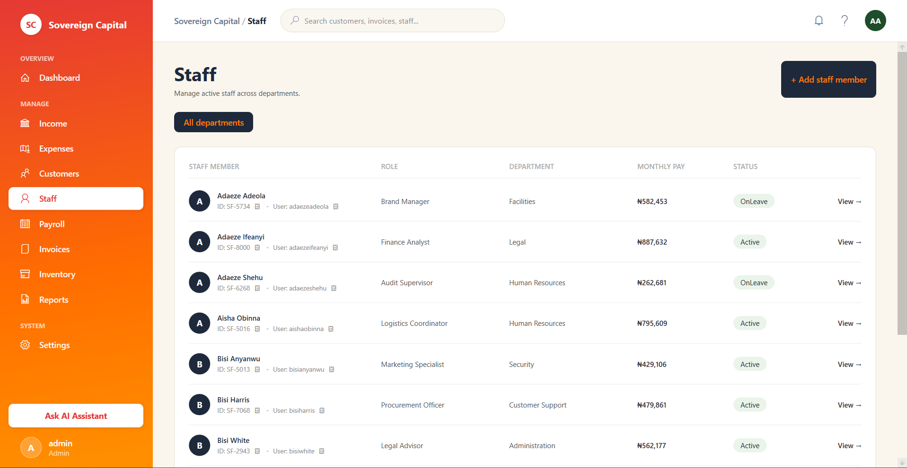
*Onboard team members, auto-generate login credentials, and manage department structures.*

### Payroll runs
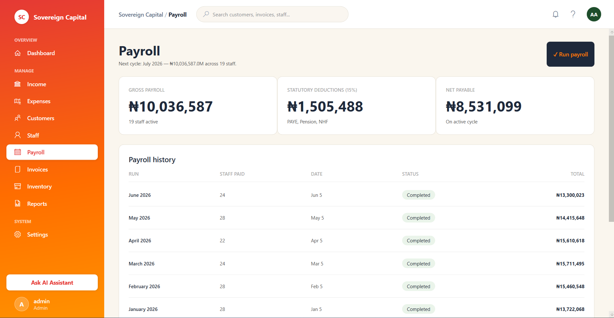
*Process monthly salaries, calculate statutory deductions (tax, pension, HMO premiums) with one-click.*

### Invoice Generator
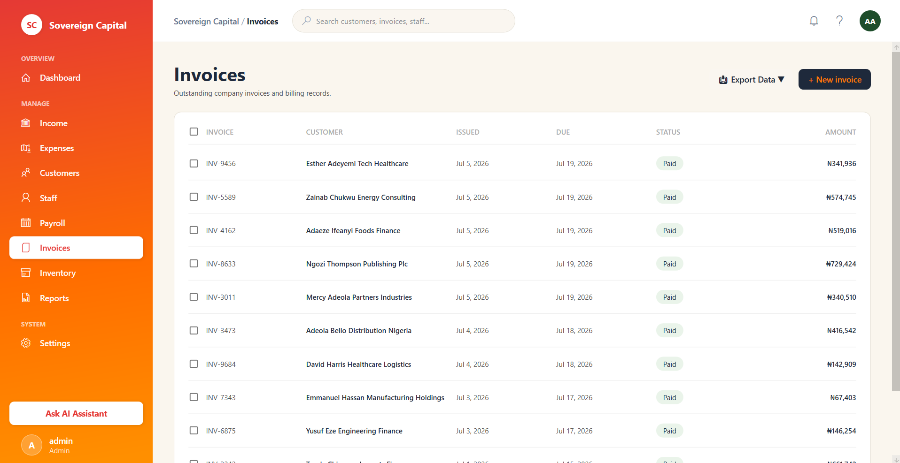
*Issue professional invoices, track payment status (Paid, Unpaid, Overdue) and export to PDF.*

### Income Tracker
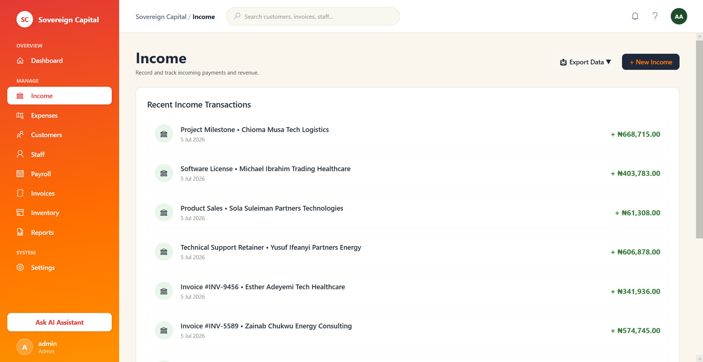
*View and filter income items, view detailed row popups, and search transactions.*

### Expenses Page
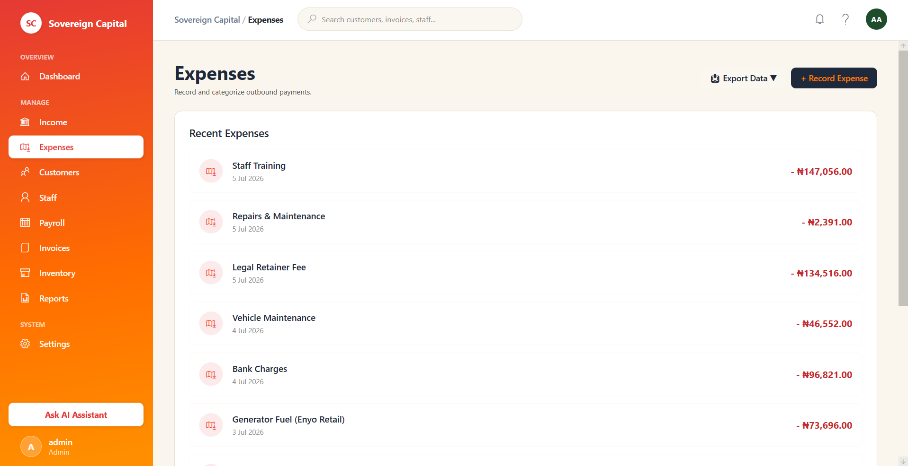
*Monitor outgoing funds, log overheads, and see auto-logged product purchase expenses.*

### Profile Setup
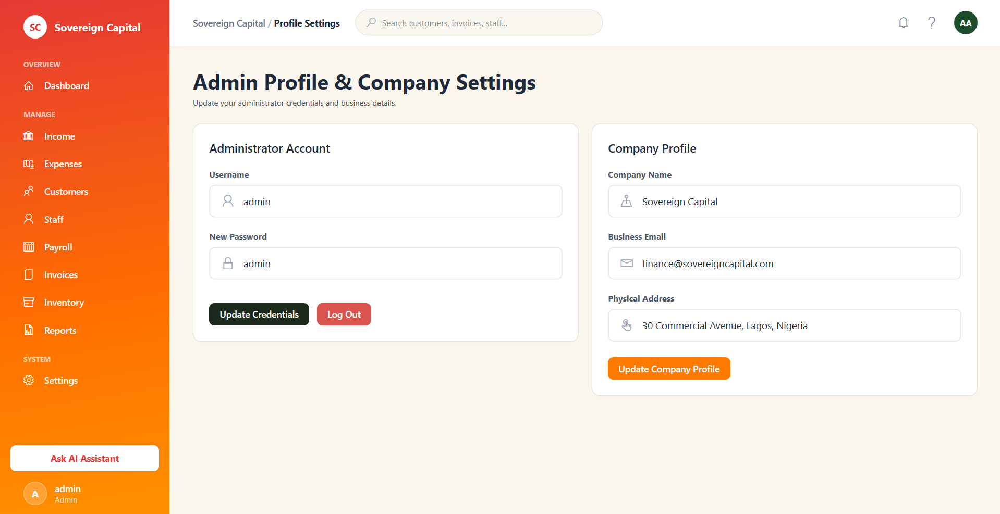
*Set company name, business email, address, tax rate (%), and select localized default currency.*

### Application Settings
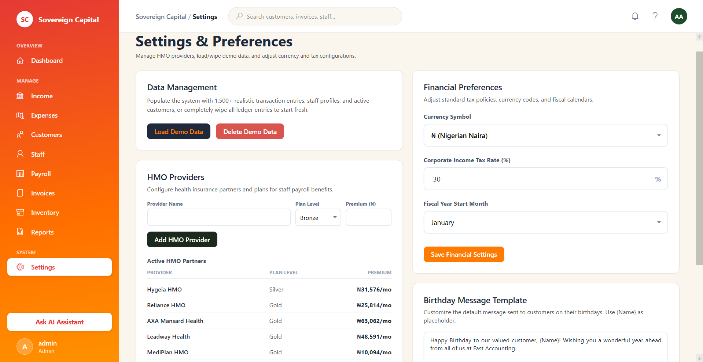
*Manage administrative settings, update credentials, change HMO plans, and load sample demo data.*

### Financial Reports
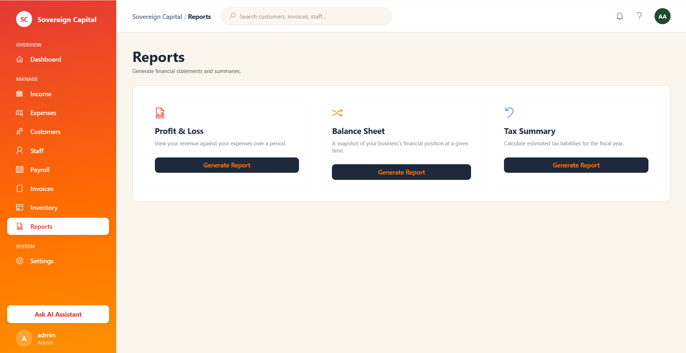
*Generate Profit & Loss statements, Balance Sheets, and Tax Summary reports with instant PDF/Excel/Word/Email export options.*

</div>

---

## ✨ Features

### 💰 Financial Management
- **Income Tracking** — Record all revenue streams with descriptions, dates, and amounts
- **Expense Tracking** — Log business expenditures with automatic categorization
- **Auto-Expense on Restock** — When inventory is restocked, a purchase expense is automatically generated (`Quantity × CostPrice`)
- **Cash Flow Charts** — 6-month visual comparison of income vs. expenses (bar & line charts)
- **Transaction History** — Paginated, searchable list of all financial movements

### 📦 Inventory Management
- **Product Catalogue** — Add, edit, delete products with Cost Price, Selling Price, and Reorder Levels
- **Stock Status Badges** — Auto-detect Low Stock items with visual color-coded indicators
- **Quick Restock** — One-click restock (+100 units) directly from the inventory list
- **Restock Filter** — Filter to show only items needing replenishment
- **Profit Margin Calculator** — Displays markup percentage per product in the detail view

### 👥 Customer Management
- **Customer Profiles** — Full name, phone, email, address, date of birth, and notes
- **Birthday Reminders** — Dashboard widget shows today's and upcoming customer birthdays
- **Message System** — Send personalized wish messages to customers via a popup input window
- **Role-Based Privacy** — Staff users cannot view sensitive customer data (email, phone, address, DOB)
- **Paginated List** — Fast browsing with 50 records per page and a search bar

### 👨‍💼 Staff Management
- **Staff Profiles** — Full contact details, role assignment (Admin/Staff), and department
- **Auto-Generated Credentials** — System auto-generates Staff ID (`sf-XXXX`) and username upon creation
- **Send Credentials** — Admin can send login credentials from the staff detail popup
- **Copy with Feedback** — Copy Staff ID or username with visual confirmation dialog
- **Admin-Only Access** — Staff tab hidden from non-admin users

### 💸 Payroll
- **Monthly Payroll Runs** — Process payroll for all active staff in a single click
- **Automatic Deductions** — Applies statutory tax (15%), pension (8%), and HMO premiums
- **Payroll History** — Paginated historical payroll records
- **HMO Providers** — Configure health insurance partners with Bronze/Silver/Gold plans

### 🧾 Invoices
- **Create & Manage Invoices** — Generate professional invoices linked to customers
- **Invoice Status** — Track Paid / Unpaid / Overdue at a glance
- **PDF Export** — Export invoices as PDF for sharing with clients

### 📊 Reports
- **Financial Summary Reports** — Monthly income, expenses, and net profit
- **Export to PDF** — Save and share full financial reports
- **Date Range Filtering** — Filter by custom date ranges

### 🔐 Role-Based Access Control

| Feature | Admin | Staff |
|---------|-------|-------|
| Dashboard | ✅ Full | ✅ Limited |
| Income & Expenses | ✅ | ✅ |
| Customer sensitive data (email, phone, DOB) | ✅ Visible | ❌ Hidden |
| Customer editing | ✅ | ❌ |
| Staff management tab | ✅ | ❌ Hidden |
| Payroll | ✅ | ❌ |
| Company Profile editing | ✅ | ❌ |
| Settings | ✅ | ✅ View only |
| Reports | ✅ | ✅ |

### 🤖 AI Assistant
- Built-in panel that flags payroll issues, overdue invoices, and provides actionable business insights

---

## 🏗️ Tech Stack

| Layer | Technology |
|-------|-----------|
| **UI Framework** | WPF (Windows Presentation Foundation) |
| **Runtime** | .NET 8.0 |
| **Language** | C# 12 |
| **Database** | SQLite (via Entity Framework Core) |
| **ORM** | Entity Framework Core 8 |
| **Charts** | ScottPlot (WPF) |
| **Architecture** | MVVM + Code-behind |

---

## 🛠️ Build from Source

```bash
# Prerequisites: .NET 8.0 SDK + Visual Studio 2022 (or VS Code)

# Clone the repository
git clone https://github.com/segunmicheal27/FastAccountingSoftware.git
cd FastAccountingSoftware

# Run in development mode
dotnet run

# Or build a Release binary
dotnet build -c Release
# Output: bin\Release\net8.0-windows\FastAccountingSoftware.exe
```

---

## 📁 Project Structure

```
FastAccountingSoftware/
├── Assets/                     # App icons, logos, images
├── Models/                     # Entity Framework data models
│   ├── AppDbContext.cs          # SQLite database context
│   ├── Customer.cs              # Customer model
│   ├── InventoryItem.cs         # Product/inventory model
│   ├── Transaction.cs           # Income & expense transactions
│   ├── StaffMember.cs           # Staff profiles
│   ├── PayrollRun.cs            # Payroll history records
│   ├── User.cs                  # Login user accounts
│   └── CompanyProfile.cs        # Company settings
├── Views/                      # All WPF pages and windows
│   ├── LoginPage.xaml           # Authentication screen
│   ├── MainPage.xaml            # Shell with sidebar navigation
│   ├── DashboardPage.xaml       # KPI overview & charts
│   ├── IncomePage.xaml          # Income transactions
│   ├── ExpensesPage.xaml        # Expense transactions
│   ├── CustomersPage.xaml       # Customer management
│   ├── StaffPage.xaml           # Staff management
│   ├── PayrollPage.xaml         # Payroll processing
│   ├── InvoicesPage.xaml        # Invoice management
│   ├── InventoryPage.xaml       # Product catalogue
│   ├── ReportsPage.xaml         # Financial reports
│   ├── ProfilePage.xaml         # Admin & company settings
│   └── SettingsPage.xaml        # App configuration
├── ViewModels/                 # MVVM ViewModels
├── App.xaml.cs                 # App entry point & global state
├── CustomMessageBox.cs         # Reusable dialog component
├── installer.iss               # Inno Setup installer script
└── LICENSE                     # Proprietary license
```

---

## 📋 Changelog

### v1.0.0 (July 2025)
- ✅ Full admin & staff role-based access control
- ✅ Inventory with auto-expense generation on restock
- ✅ Customer birthday dashboard widget with send-wishes messaging
- ✅ Paginated lists (Customers, Staff, Income, Expenses, Payroll)
- ✅ Monthly payroll processing with automatic deductions
- ✅ Invoice creation and PDF export
- ✅ 6-month cash flow charts (bar & line)
- ✅ AI assistant panel for business insights
- ✅ Send credentials feature for staff onboarding
- ✅ Custom message dialog for customer communication
- ✅ Enter key support on login screen
- ✅ Clipboard copy feedback on staff credentials

---

## ⚖️ License

This software is **proprietary**. All rights reserved.

© 2025 Segun Micheal — You may NOT copy, reproduce, distribute, or create derivative works from this software without explicit written permission.

See the [LICENSE](LICENSE) file for full terms.

---

## 📬 Contact

**Segun Micheal**  
📧 segunmicheal27@yahoo.com  
🐙 [github.com/segunmicheal27](https://github.com/segunmicheal27)

---

<div align="center">
  <sub>Built with ❤️ in Nigeria 🇳🇬 | FastAccountingSoftware © 2025</sub>
</div>
