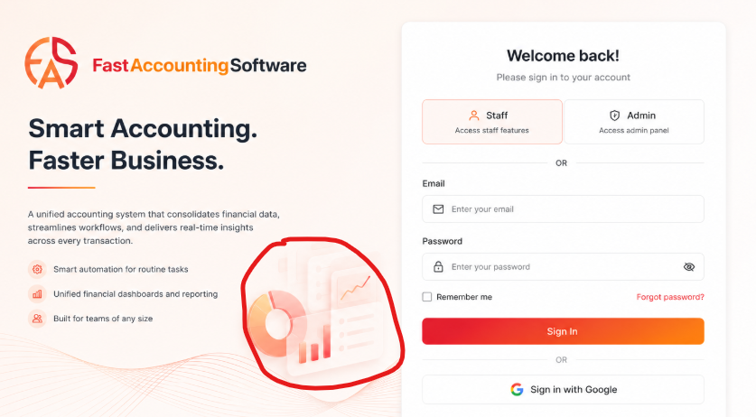
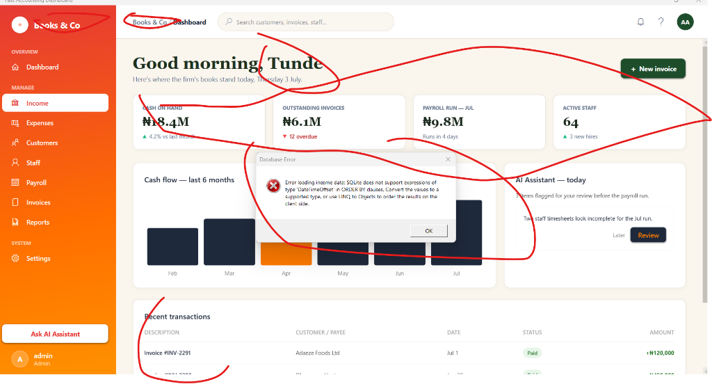
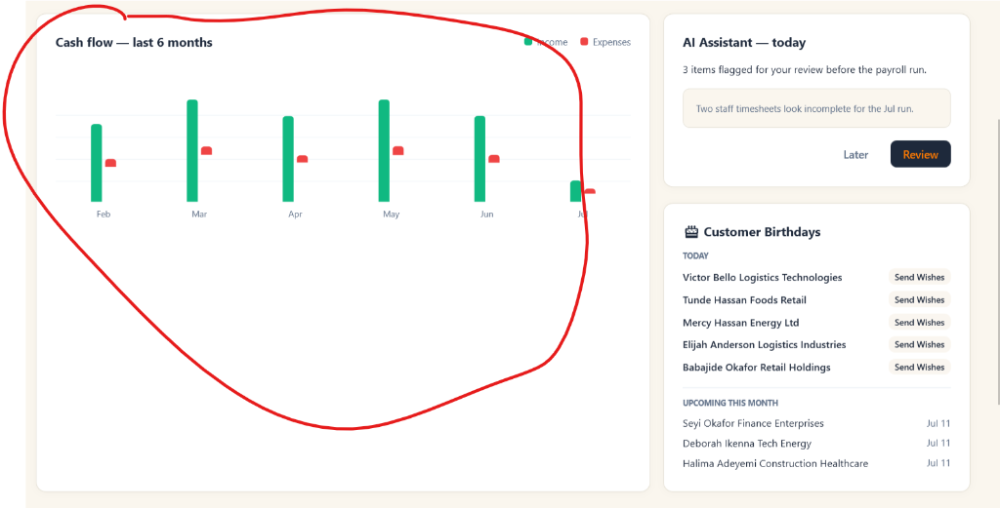
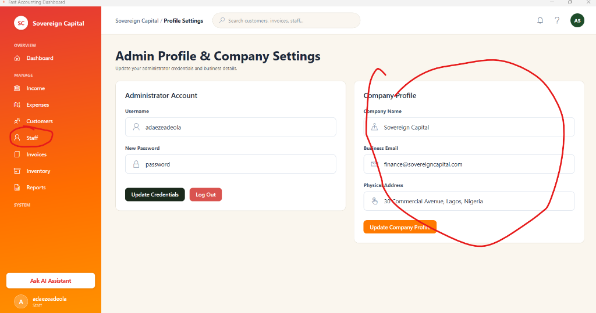

<div align="center">


# FastAccountingSoftware

**Smart Accounting. Faster Business.**

A modern, full-featured desktop accounting system built with WPF (.NET 8) for Nigerian small-to-medium businesses. Manage your finances, staff, customers, inventory, invoices, and payroll — all from one beautiful interface.

[](LICENSE)
[](https://github.com/segunmicheal27/FastAccountingSoftware)
[](https://dotnet.microsoft.com/)
[](https://github.com/segunmicheal27/FastAccountingSoftware)

</div>

---

## 📸 Screenshots

<div align="center">

### Login Page

*Dual-role login — Admin & Staff with secure authentication*

### Dashboard

*Real-time financial overview with KPI cards, cash flow charts, AI assistant, and customer birthday reminders*

### Cash Flow Chart

*6-month income vs. expenses bar chart with live data*

### Settings & Preferences

*Company profile, financial preferences, HMO providers, and data management*

</div>

---

## ✨ Features

### 💰 Financial Management
- **Income Tracking** — Record all revenue streams with descriptions, dates, and amounts
- **Expense Tracking** — Log business expenditures with automatic categorization
- **Auto-Expense on Restock** — When inventory is restocked, a purchase expense is automatically generated (`Quantity × CostPrice`)
- **Cash Flow Charts** — 6-month visual comparison of income vs. expenses (bar & line charts)
- **Transaction History** — Paginated, searchable list of all financial movements

### 📦 Inventory Management
- **Product Catalogue** — Add, edit, delete products with Cost Price, Selling Price, and Reorder Levels
- **Stock Status Badges** — Auto-detect Low Stock items with visual color-coded indicators
- **Quick Restock** — One-click restock (+100 units) directly from the inventory list
- **Restock Filter** — Filter to show only items needing replenishment
- **Profit Margin Calculator** — Displays markup percentage per product in the detail view

### 👥 Customer Management
- **Customer Profiles** — Full name, phone, email, address, date of birth, and notes
- **Birthday Reminders** — Dashboard widget shows today's and upcoming customer birthdays with a "Send Wishes" shortcut
- **Message System** — Send personalized wish messages directly to customers via a popup input window
- **Role-Based Privacy** — Staff users cannot view sensitive customer data (email, phone, address, DOB)
- **Paginated List** — Fast browsing with 50 records per page and a search bar

### 👨‍💼 Staff Management
- **Staff Profiles** — Full contact details, role assignment (Admin/Staff), and department
- **Auto-Generated Credentials** — System auto-generates secure Staff ID (`sf-XXXX`) and username upon staff creation
- **Send Credentials** — Admin can send login credentials directly from the staff detail popup
- **Copy with Feedback** — Copy Staff ID or username to clipboard with visual confirmation dialog
- **Admin-Only Access** — Staff tab and staff management hidden from non-admin users

### 💸 Payroll
- **Monthly Payroll Runs** — Process payroll for all active staff in a single click
- **Automatic Deductions** — Applies statutory tax (15%), pension (8%), and HMO premiums automatically
- **Payroll History** — Paginated historical payroll records per staff member
- **HMO Providers** — Configure health insurance partners with Bronze/Silver/Gold plan tiers

### 🧾 Invoices
- **Create & Manage Invoices** — Generate professional invoices linked to customers
- **Invoice Status** — Track Paid / Unpaid / Overdue status at a glance
- **Invoice Detail View** — Full line-item view with customer info, totals, and dates
- **PDF Export** — Export invoices as PDF for sharing with clients

### 📊 Reports
- **Financial Summary Reports** — Monthly income, expenses, and net profit reports
- **Export to PDF** — Save and share full financial reports
- **Date Range Filtering** — Filter reports by custom date ranges

### 🔐 Role-Based Access Control
| Feature | Admin | Staff |
|---------|-------|-------|
| Dashboard | ✅ Full access | ✅ Limited |
| Income & Expenses | ✅ | ✅ |
| Customer details (email, phone, DOB) | ✅ Visible | ❌ Hidden |
| Customer editing | ✅ | ❌ |
| Staff management tab | ✅ | ❌ Hidden |
| Payroll | ✅ | ❌ |
| Company Profile editing | ✅ | ❌ |
| Settings | ✅ | ✅ View only |
| Reports | ✅ | ✅ |

### 🤖 AI Assistant
- Built-in AI panel that flags payroll issues, alerts for overdue invoices, and provides actionable business insights

---

## 🏗️ Tech Stack

| Layer | Technology |
|-------|-----------|
| **UI Framework** | WPF (Windows Presentation Foundation) |
| **Runtime** | .NET 8.0 |
| **Language** | C# 12 |
| **Database** | SQLite (via Entity Framework Core) |
| **ORM** | Entity Framework Core 8 |
| **Charts** | ScottPlot (WPF) |
| **Architecture** | MVVM + Code-behind |

---

## 🚀 Getting Started

### Prerequisites

- Windows 10 or Windows 11
- [.NET 8.0 SDK](https://dotnet.microsoft.com/en-us/download/dotnet/8.0) *(for building from source)*
- Visual Studio 2022+ *(optional, for development)*

### Option 1 — Run from Source

```bash
# Clone the repository
git clone https://github.com/segunmicheal27/FastAccountingSoftware.git

# Navigate to project directory
cd FastAccountingSoftware

# Run the application
dotnet run
```

### Option 2 — Install the Executable

> 📦 Download the latest installer from the [Releases](https://github.com/segunmicheal27/FastAccountingSoftware/releases) page.

1. Download `FastAccountingSoftware-Setup.exe`
2. Run the installer and follow the setup wizard
3. Launch the app from your Desktop or Start Menu

---

## 🔑 Default Login Credentials

When you first launch the app, load the demo data from **Settings → Load Demo Data**, then use:

| Role | Username / Staff ID | Password |
|------|---------------------|----------|
| **Admin** | `adaezeadeola` | `password` |
| **Staff** | `sf-XXXX` *(shown in Staff page)* | `password` |

> ⚠️ Change your admin password immediately after first login via **Settings → Administrator Account**.

---

## 📁 Project Structure

```
FastAccountingSoftware/
├── Assets/                     # App icons, logos, images
├── Models/                     # Entity Framework data models
│   ├── AppDbContext.cs          # SQLite database context
│   ├── Customer.cs              # Customer model
│   ├── InventoryItem.cs         # Product/inventory model
│   ├── Transaction.cs           # Income & expense transactions
│   ├── StaffMember.cs           # Staff profiles
│   ├── PayrollRun.cs            # Payroll history records
│   ├── User.cs                  # Login user accounts
│   └── CompanyProfile.cs        # Company settings
├── Views/                      # All WPF pages and windows
│   ├── LoginPage.xaml           # Authentication screen
│   ├── MainPage.xaml            # Shell with sidebar navigation
│   ├── DashboardPage.xaml       # KPI overview & charts
│   ├── IncomePage.xaml          # Income transactions
│   ├── ExpensesPage.xaml        # Expense transactions
│   ├── CustomersPage.xaml       # Customer management
│   ├── StaffPage.xaml           # Staff management
│   ├── PayrollPage.xaml         # Payroll processing
│   ├── InvoicesPage.xaml        # Invoice management
│   ├── InventoryPage.xaml       # Product catalogue
│   ├── ReportsPage.xaml         # Financial reports
│   ├── ProfilePage.xaml         # Admin & company settings
│   └── SettingsPage.xaml        # App configuration
├── ViewModels/                 # MVVM ViewModels
├── App.xaml.cs                 # App entry point & global state
├── CustomMessageBox.cs         # Reusable dialog component
└── LICENSE                     # Proprietary license
```

---

## 📋 Changelog

### v1.0.0 (July 2025)
- ✅ Full admin & staff role-based access control
- ✅ Inventory management with auto-expense generation on restock
- ✅ Customer birthday dashboard widget with send-wishes messaging
- ✅ Paginated lists (Customers, Staff, Income, Expenses, Payroll)
- ✅ Monthly payroll processing with automatic deductions
- ✅ Invoice creation and PDF export
- ✅ 6-month cash flow charts (bar & line)
- ✅ AI assistant panel for business insights
- ✅ Send credentials feature for staff onboarding
- ✅ Custom message dialog for customer communication

---

## ⚖️ License

This software is **proprietary**. All rights reserved.

© 2025 Segun Micheal — You may NOT copy, reproduce, distribute, or create derivative works from this software without explicit written permission.

See the [LICENSE](LICENSE) file for full terms.

---

## 📬 Contact

**Segun Micheal**  
📧 segunmicheal27@yahoo.com  
🐙 [github.com/segunmicheal27](https://github.com/segunmicheal27)

---

<div align="center">
  <sub>Built with ❤️ in Nigeria 🇳🇬 | FastAccountingSoftware © 2025</sub>
</div>
